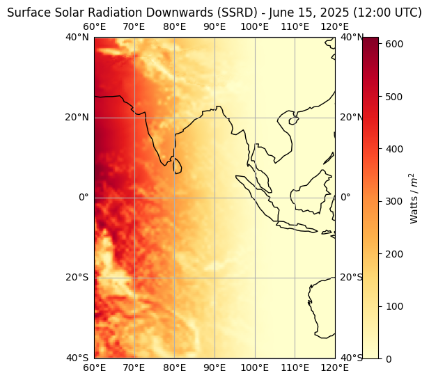
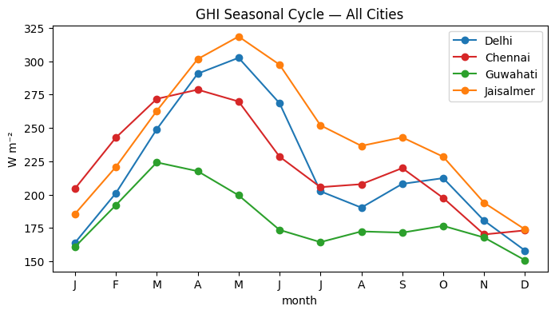
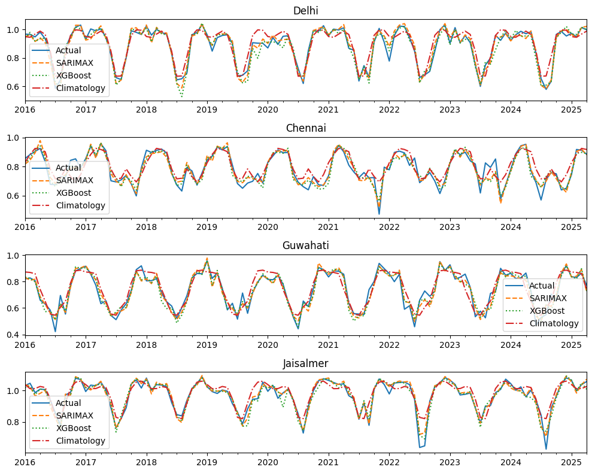
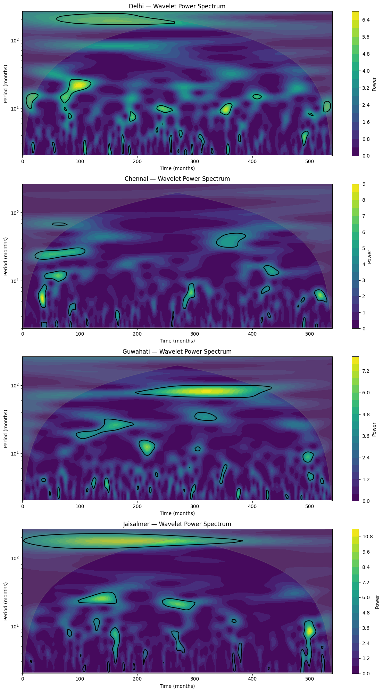

# SolarKt-India

### Four-City Solar Irradiance Climatology, Wavelet Spectral Analysis & SARIMAX–XGBoost Forecasting (1981–2025)


A 45-year, ERA5-reanalysis-driven assessment of surface solar irradiance and solar PV resource potential across four climatically distinct Indian cities — combining clearness-index climatology, long-memory/stationarity diagnostics, Morlet wavelet spectral analysis, and SARIMAX + XGBoost forecasting with large-scale climate-mode predictors (ENSO, IOD).

<p align="center">
  
</p>

---

## Why these four cities?

The cities were chosen to span India's major climate regimes, so that any signal found is a genuine cross-regime pattern rather than a local artifact:

| City | Coordinates | Altitude | Region / Climate regime |
|---|---|---|---|
| **Delhi** | 28.50°N, 77.25°E | 216 m | Indo-Gangetic Plain — humid subtropical, strong aerosol/haze seasonality |
| **Chennai** | 13.00°N, 80.25°E | 6 m | Tamil Nadu coast — tropical, dual monsoon (SW + NE) exposure |
| **Guwahati** | 26.25°N, 91.75°E | 51 m | Northeast India — humid, heavy cloud cover, high seasonal variance |
| **Jaisalmer** | 27.00°N, 70.75°E | 225 m | Thar Desert, Rajasthan — arid, highest clear-sky fraction in India |

## Data

| Variable | Source | Role |
|---|---|---|
| Surface Solar Radiation Downwards (SSRD / GHI) | [ARCO-ERA5](https://github.com/google-research/arco-era5) (Google Cloud public Zarr store) | Target variable |
| Total Cloud Cover (TCC) | ARCO-ERA5 | Exogenous predictor |
| Total Column Water Vapour (TCWV) | ARCO-ERA5 | Exogenous predictor |
| Oceanic Niño Index (ONI) | NOAA CPC | Exogenous predictor (ENSO state) |
| Dipole Mode Index (DMI / IOD) | HadISST-derived | Exogenous predictor (Indian Ocean Dipole) |

`notebooks/01_data_fetcher.ipynb` demonstrates the SSRD pull from the ARCO-ERA5 Zarr archive (anonymous GCS access, no API key needed) and resamples to monthly means per city. The same pattern — `.sel(latitude=, longitude=, method="nearest")` → `.resample(time="MS").mean()` — extends directly to TCC and TCWV from the same store. ONI and DMI are short monthly index series, downloaded separately from NOAA CPC / HadISST and dropped into `data/` as `oni.nc` and `dmi.had.long.nc`. See `data/README.md` for the exact file layout the downstream notebooks expect.

> **Data is not committed to this repo.** NetCDF files are excluded via `.gitignore` — regenerate them by running `01_data_fetcher.ipynb`, or drop your own pre-fetched files into `data/`.

## Pipeline

| # | Notebook | What it does |
|---|---|---|
| 1 | `01_data_fetcher.ipynb` | Pulls hourly SSRD from ARCO-ERA5 for each city (1981–2025), resamples to monthly means, exports per-city NetCDF |
| 2 | `02_climatology_wavelet_analysis.ipynb` | Converts GHI → clearness index *K_t* (Ineichen clear-sky model via `pvlib`), builds the anomaly series, runs STL decomposition, ADF/KPSS stationarity tests, Hurst exponent + DFA long-memory diagnostics, ACF/PACF, AR/ARMA/SARIMA baselines, and Morlet continuous wavelet transform (`pycwt`) to identify dominant periodicities (annual, quasi-biennial, decadal) |
| 3 | `03_sarimax_xgboost_forecasting.ipynb` | Builds a leak-free exogenous feature set (TCC, TCWV, ONI, DMI at causally-restricted lags via cross-correlation), fits SARIMAX and XGBoost on 1981–2015, evaluates one-step-ahead walk-forward forecasts on 2016–2025 against a climatology baseline using RMSE, skill score, and the Diebold–Mariano test; also downscales monthly *K_t* back to an hourly GHI series to estimate long-run solar PV energy yield (kWh/kWp/year) per city |

## Key findings

**Clearness-index climatology (1981–2025)**

| City | Mean GHI (W/m²) | Mean *K_t* | *K_t* Std | Seasonal strength F_S | Hurst H |
|---|---|---|---|---|---|
| Delhi | 219.0 | 0.893 | 0.129 | 0.890 | 0.637 |
| Chennai | 222.5 | 0.798 | 0.100 | 0.830 | 0.663 |
| Guwahati | 181.0 | 0.740 | 0.139 | 0.904 | 0.586 |
| Jaisalmer | 242.9 | 0.976 | 0.092 | 0.873 | 0.622 |

All four series show H > 0.5, i.e. persistent long-range memory in the *K_t* anomaly — none of them behave like white noise month-to-month. Jaisalmer has the highest and most stable clearness index, consistent with its desert, low-aerosol, low-cloud regime; Guwahati has the lowest mean and highest variance, consistent with persistent NE-India cloudiness.

**SARIMAX vs. XGBoost vs. climatology — one-step-ahead, 2016–2025 holdout**

| City | RMSE (climatology) | RMSE (SARIMAX) | RMSE (XGBoost) | Skill — SARIMAX | Skill — XGBoost | Diebold–Mariano p |
|---|---|---|---|---|---|---|
| Delhi | 0.0527 | 0.0275 | 0.0330 | 0.478 | 0.374 | 0.101 |
| Chennai | 0.0608 | 0.0345 | 0.0376 | 0.433 | 0.382 | 0.040 |
| Guwahati | 0.0592 | 0.0394 | 0.0398 | 0.334 | 0.327 | 0.833 |
| Jaisalmer | 0.0475 | 0.0230 | 0.0293 | 0.515 | 0.383 | 0.021 |

SARIMAX with exogenous climate-mode predictors beats both the climatology baseline and XGBoost everywhere, and the Diebold–Mariano test confirms that edge is statistically significant for Chennai and Jaisalmer (p < 0.05). Guwahati is the hardest city to forecast for either model — consistent with its weaker seasonal strength and lowest Hurst exponent above.

**Estimated long-run solar PV yield** (45-yr average, 1 kWp system, 75% performance ratio):

| City | Avg. annual yield (kWh/kWp/yr) |
|---|---|
| Jaisalmer | 1596.7 |
| Chennai | 1461.8 |
| Delhi | 1439.3 |
| Guwahati | 1189.1 |

## Sample output

<p align="center">
  
</p>
<p align="center">
  
</p>
<p align="center">

</p>

## Repository structure

```
solarkt-india/
├── README.md
├── LICENSE
├── requirements.txt
├── environment.yml
├── .gitignore
├── 01_data_fetcher.ipynb
│── 02_climatology_wavelet_analysis.ipynb
│── 03_sarimax_xgboost_forecasting.ipynb
├── README.md          # expected file layout (data itself is git-ignored)
           # exported plots (sample figures included)
```

## Setup

```bash
git clone https://github.com/<your-username>/solarkt-india.git
cd solarkt-india

python -m venv .venv
source .venv/bin/activate        # Windows: .venv\Scripts\activate
pip install -r requirements.txt
```

or with conda:

```bash
conda env create -f environment.yml
conda activate solarkt-india
```

## Usage

Run the notebooks in order:

1. `notebooks/01_data_fetcher.ipynb` — fetches and caches the raw ERA5 NetCDF files into `data/` (one-time, ~tens of minutes depending on bandwidth; needs no credentials, just anonymous GCS access)
2. `notebooks/02_climatology_wavelet_analysis.ipynb` — exploratory climatology, stationarity, and wavelet analysis
3. `notebooks/03_sarimax_xgboost_forecasting.ipynb` — forecasting models, evaluation, and PV yield estimate

## Caveats

- All irradiance figures are derived from **ERA5 reanalysis**, not ground pyranometer measurements — treat absolute GHI/yield numbers as model estimates, not calibrated truth.
- The Ineichen clear-sky model is climatological, not turbidity-corrected per city/season, so *K_t* carries some of that simplification.
- ONI and DMI are coarse monthly indices; cross-correlation lag selection is restricted to non-anticipative (≤ 0) lags to keep the forecast genuinely causal, but with only 45 years of monthly data the lag estimates carry real sampling uncertainty.

## Data & method citations

- Hersbach, H. et al. (2020), *ERA5 hourly data on single levels*, Copernicus Climate Change Service (C3S) Climate Data Store, via [ARCO-ERA5](https://github.com/google-research/arco-era5).
- Holben, B. et al. / `pvlib-python` — Ineichen–Perez clear-sky model.
- Torrence, C. & Compo, G. P. (1998), *A Practical Guide to Wavelet Analysis*, BAMS — via the [`pycwt`](https://github.com/regeirk/pycwt) implementation.
- NOAA CPC — Oceanic Niño Index (ONI).
- HadISST — Dipole Mode Index (IOD).

## License

MIT — see [LICENSE](LICENSE).

## Author

Shubham
